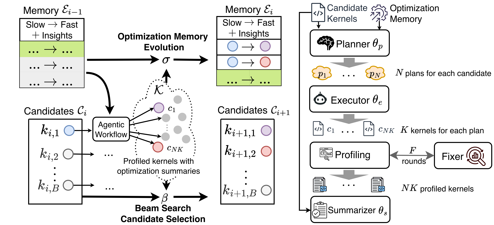

<div align="center">
    
</div> 

# AccelOpt: Self-improving Agents for AI Accelerator Kernel Optimization

[](https://arxiv.org/pdf/2511.15915)
[](https://zhang677.github.io/blog_md/accelopt.html)

AccelOpt is a self-improving large language model (LLM) agentic system that autonomously optimizes
kernels for emerging AI acclerators, eliminating the need for expert-provided hardware-specific optimization
knowledge. AccelOpt explores the kernel optimization space through iterative generation, informed by an
optimization memory that curates experiences and insights from previously encountered slow-fast kernel pairs.

🚧 This repository is still under construction.

## Setup
### Trainium 
#### Machines
EC2 Instance: trn1.32xlarge

AMI: Deep Learning AMI Neuron (Ubuntu 22.04)
#### Install
```
source /opt/aws_neuronx_venv_pytorch_2_7/bin/activate # Check the PyTorch version of your AMI
pip install logfire
pip install openai-agents
git clone git@github.com:zhang677/AccelOpt.git
cd AccelOpt
python setup.py install
```
#### Run
`experiments/full_complete_local` shows how to run AccelOpt on NKIBench with a local served gpt-oss-120b.


### NVIDIA GPU 
#### Machines
EC2 Instance: p5.48xlarge

AMI: Deep Learning OSS Nvidia Driver AMI GPU PyTorch 2.8 (Ubuntu 24.04)
#### Install
```
# Create a PyTorch environment first
pip install logfire
pip install openai-agents
git clone https://github.com/zhang677/flashinfer-bench.git # DPS is not consistent with flashinfer-trace now
cd flashinfer-bench
pip install -v -e .
cd ..
git clone git@github.com:zhang677/AccelOpt.git
cd AccelOpt
python setup.py install
```
#### Run
`experiments/flb_full_complete_local` shows how to run AccelOpt on [FlashInfer-Bench](https://github.com/flashinfer-ai/flashinfer-bench) with a local served gpt-oss-120b.

#### Kernel Database
We also implemented a kernel database following the schema in `templates/schema_v1.txt` compatible with FlashInfer-Bench. The scripts in this repo still operate on intermediate json files. We will release the kernel database infra in the future.

# NKIBench: Kernel Benchmark for AWS Trainium accelerators

NKIBench is a new benchmark suite of AWS Trainium accelerator kernels with varying complexity
extracted from real-world LLM workloads to evaluate the effectiveness of AccelOpt. 

## Dataset
All the kernels are under `/NKIBench`. Kernels are
grouped by operator name and configuration in a structured
storage format as shown in the `/NKIBench/summary.json`

## Profiling
AccelOpt provides a `NKIKernel` class that is pluggable to any AI optimizers. `/tests` shows how to use the profiling API for single and a group of NKI kernels. 
```python
from accelopt.kernel_wrapper import NKIKernel
nki_kernel = NKIKernel(program_path, base_numpy_path)
result = nki_kernel.profile(save_fields)
```

NKIBench estimates the best achievable performance offered by the Trainium hardware, which offers additional insights on how effective AccelOpt has been in exploring the entire optimization landscape. The best achievable performance is calculated in `experiments/full_complete_local/calculate_percentage_of_peak.py`

# Result
<div align="center">
    
</div>
Per-task kernel improvement achieved using Claude Sonnet 4 and AccelOpt (gpt-oss-120b + Qwen3-Coder-480B) on Trainium 1 of NKIBench.

<div align="center">
    
</div>
Triton kernel improvement achieved using AccelOpt with Fixer on H100 SXM5 over FlashInfer across 8 attention workload of FlashInfer-Bench. Fixers and executors use the same model and all the other agents use gpt-oss-120b. These experiements used `./templates/fib/complete_local_prompts/run_single_loop.sh` with `PROMPT_BASE_DIR=./prompts/fib`.

# Citation

This work will appear in MLSys 2026. This is a follow-up to *Adaptive Self-improvement LLM Agentic System for ML Library Development* (ICML 2025) [[paper](https://proceedings.mlr.press/v267/zhang25at.html)] [[blog](https://zhang677.github.io/blog_md/aspl.html)] [[code](https://github.com/zhang677/PCL-lite)]. If you find this project useful, please cite:
```
@inproceedings{zhang2025adaptive,
  title={Adaptive Self-improvement LLM Agentic System for ML Library Development},
  author={Zhang, Genghan and Liang, Weixin and Hsu, Olivia and Olukotun, Kunle},
  booktitle={Proceedings of the 42nd International Conference on Machine Learning},
  year={2025}
}

@article{zhang2025accelopt,
  title={AccelOpt: A Self-Improving LLM Agentic System for AI Accelerator Kernel Optimization},
  author={Zhang, Genghan and Zhu, Shaowei and Wei, Anjiang and Song, Zhenyu and Nie, Allen and Jia, Zhen and Vijaykumar, Nandita and Wang, Yida and Olukotun, Kunle},
  journal={arXiv preprint arXiv:2511.15915},
  year={2025}
}
```

